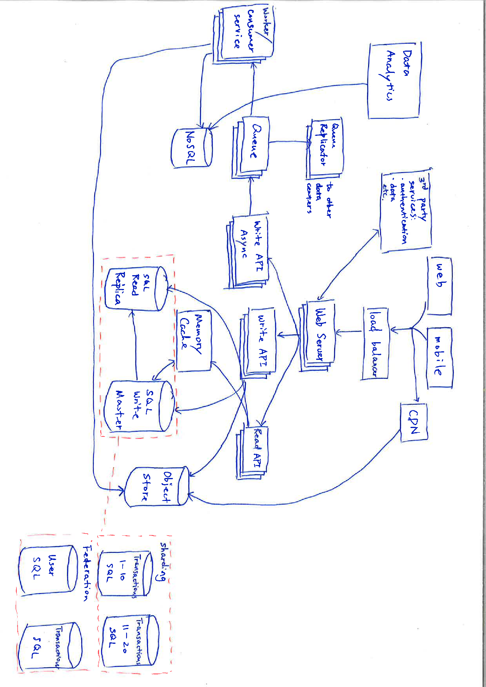

## System Design
This repository contains tactics and design thinking when designing a system. Certain code/examples are in the subdirectory

#### SNAKE Rule
- S: Scenario
- N: Necessary -> requirements/hypothesis
- A: Application -> service/algorithm
- K: Kilobit -> Data
- E: Evolve
 
#### System Design Considerations
1. Business requirements
2. high-level components
3. Technical details
4. typical pros and cons to adjust for real business needs (e.g. time/memory, accuracy/speed etc.)
5. storage solution, caching mechanism, queuing solution etc.

#### Pillars of Design
1. Abstraction: what is visible/invisible from a component
2. Database: sql vs NoSql, locking mechanism, how to shard etc.
3. Network flow: good to know https request lifecycle
4. Concurrency: race condition, producer/consumer, actor etc.
5. OS: memory usage, CPU, etc.
6. domain knowledge: Machine Learning, FinTech etc.

#### Thinking Process
- Top-down (e.g. YouTube recommendation)
  - Front-end & Back-end
  - 3 Steps:
    1. collect user data
    2. offline pipeline generating recommendation
    3. store & serve the data to front-end
  - Details:
    - user action through queue
    - dataset training, potentially mapreduce/hadoop the data
    - and so on :-p

#### Evaluation & Estimation
- where to store user session?
- data stored in memory or offloaded to distributed cache
- the list goes on with sub-components
- a rough estimation of memory, data volume, TPS etc. will better help with technology stack of choice
- overview of bottleneck of the system

#### Check Existing Systems
- Reddit, Facebook, Twitter, Google, YouTube, WeChat etc.
- Each with specialty, but could inspire a component
- Go into the subdirectories for more details

#### Numbers Everyone Should Know
| Operation | Time (in nanosecond) |
|---|---|
| L1 cache reference | 0.5 |
| Branch mispredict | 5 |
| L2 cache reference | 7 |
| Mutex lock/unlock | 25 - 100 |
| Main memory reference | 100 |
| Compress 1k w/cheap compression algorithm | 10,000 |
| Send 2K bytes over 1 Gbps network | 20,000 |
| Read 1 MB sequentially from memory | 250,000 |
| Round trip within the same datacenter | 500,000 |
| Disk seek | 10,000,000 |
| Read 1 MB sequentially from disk | 20,000,000 |
| Send packet CA->Netherlands->CA | 150,000,000 | 

  

