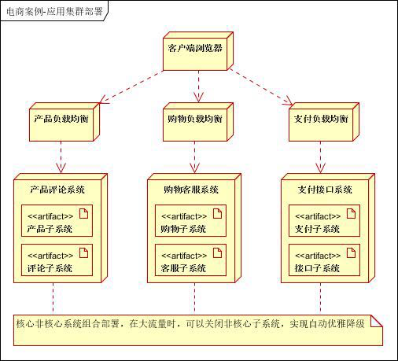
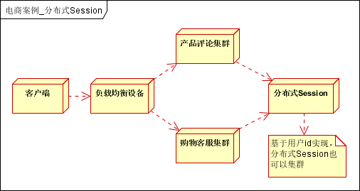
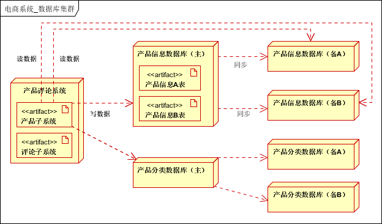
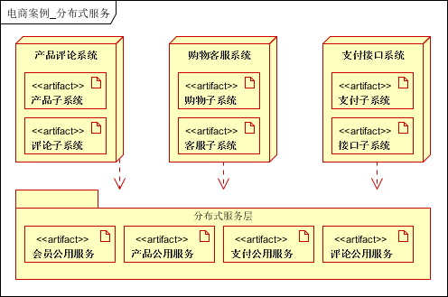
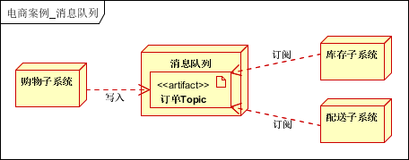
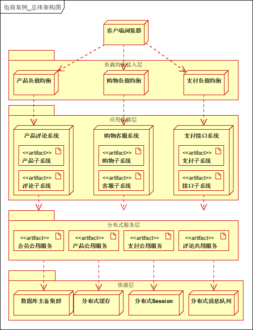

## E-Commerce Site System Design
- one of the most challenging task as it involves user management, payment, item management,
order management, high TPS, review system etc.

### 1. Requirements & Goals
#### Functional Requirements
1. B2C, with various kinds of products & services
1. review system
1. online chat system for users to communicate with customer supports
1. special events (11.11, black Friday etc.)

#### Non-Functional Requirements
- high availability
- sensitive payment data protection
- fast content delivery

#### Summary Table
| Website Requirements | Functional Requirements | Non-Functional Requirements |
| --- | --- | --- |
| all types of products | product management; categorization | requests for lots of small pictures |
| order placement | membership management; cart; checkout; | performance and usability |
| online payment | multiple payment gateways supported | redirection |
| online chat with customer support | chat bot | real-time ; high availability |
| review function | review system | |
| inventory management | integration with inventory module | consistency |
| special promotion activities | activity management; flash sale; | elasticity; high concurrency; |

### 2. Capacity & Constraints
- 5w peak write TPS
- even more read TPS, probably 10 times

#### Steps:
1. 10 million users after 5 years
1. 20/80 rule: 2 million UV (unique visitors)
1. PV (page view) = 2 mil * 30 = 60 million
1. 20/80 rule: 60 million * 0.8 = 48 million in 24 * 0.2 = 4.8 hours
1. TPS: 48 million / (4.8 * 60 * 60) = 2780
1. peak volume could be around 10k/s

- Tomcat has 150 as default value for concurrent requests, if we were to take it as 300
- 30+ servers to handle the volume

### 3. Initial Architecture and APIs
- web/phone -> LB -> web server -> File system & DB
- Clustering to achieve HA

### 4. Problems and Enhancements
##### Problems:
1. session synchronization
1. tight application coupling
1. DB trip too frequently
1. too many servers not used during normal hours
1. redundant code

##### Enhancements:
1. separation of business logic
1. application layer server clustering
1. multi-layer caching
1. single point of login
1. message queue
1. business logic as a service

### 5. Rearchitecture
##### 5.1 vertical split based on business function:
###### core system:
1. product system
1. shopping system
1. payment system
###### normal system:
1. review system
1. customer support system
1. 3rd party API integration system

##### 5.2 Clustering & Load Balancing
- LB for distributed services HA, master-slave DB for database HA
  

##### 5.3 Multi-Layer Caching
- local cache (first level) & distributed cache (second level)
- first level: key-value pair of frequently visited data
- second level: all data to be cached
- automatic expiration or triggered expiration for the cache

##### 5.4 Single Point of Login (Distributed Session)
- Session synchronization, distributed session, distributed cookie
###### Steps
1. first login, extract userid and profile information, store in distributed session
1. next login, acquire distributed session information, if not exist, back to login
1. Redis persistence can help even session server down
1. expiration time can be configured
  

##### 5.5 DB Clustering
- read-write separation: Master-Slave pattern
###### with the new architecture:
1. independent database for every sub-system
1. if database too big, divide again based on business nature
1. if too much data, divide into smaller tables
1. read-write separation after all the above steps
  

##### 5.6 Everything as a Service
- extract certain modules/functions as common services
  

##### 5.7 Message Queue
- module decouple, async, HA
###### Examples:
1. order placement
1. inventory: read and deduct inventory count
1. delivery: read and deliver
  

### 6. Overall
  
