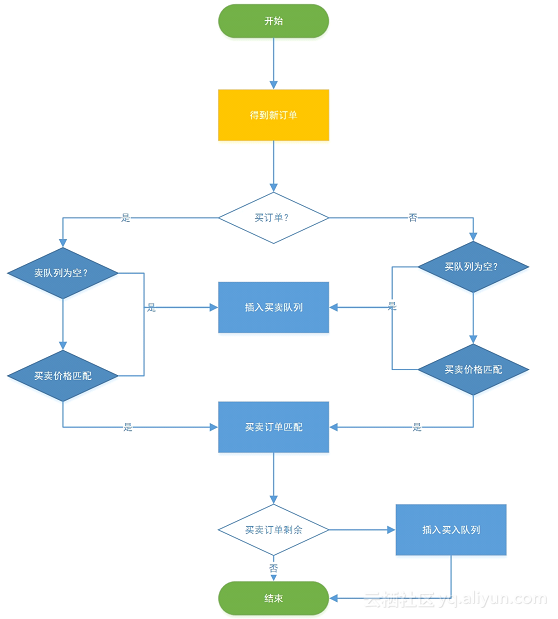

### Order Matching Engine
#### 1. Requirements
- Functional: able to match order correctly and store the store the trade information
- Non-Functional: high throughput, security, high availability, transactional
#### 2. Modules
- User Management
- Client-facing Front-end
- Persistence layer
- Order collector
- Order matching engine
#### 3. Order Matching Algorithm
- turn orders into trades
- in-memory buy queue and sell queue: ordered by price then time
- with an incoming aggress order, check the head of the order in the other queue.
 - valid matching -> trade created
 - no matching -> insert into the queue of its side
- merits:
 - much less IO work
 - if no match, O(1) operation
- drawbacks:
 - data loss if server goes down (can use kafka commit as backup or do multi-server hot backup)
 - unable to deal with all-or-nothing fill type
- illustrated below:

- 
#### 4. Multi-instance Consistency (The most difficult part)
- Every instance process the same incoming aggress order, only the master node's result gets processed further
- order matching engine considered as a deterministic pure function, same input always lead to the same output
- Always compare the result of the outputs from all the nodes, if different, something is wrong (need to think about how to handle it - may just kill it)
- Newly added server reads commit in Kafka from the beginning
- Leader in the cluster to do order matching, to produce result, if dead, nodes in the cluster to elect a new leader
#### 5. Architecture
- front-end -> order processor -> order kafka topic by product -> product cluster of order matching engine -> order match result kafka topic -> match result processor
- order matching engine may consider putting matching result at local machine log, then log collector does a broadcast
