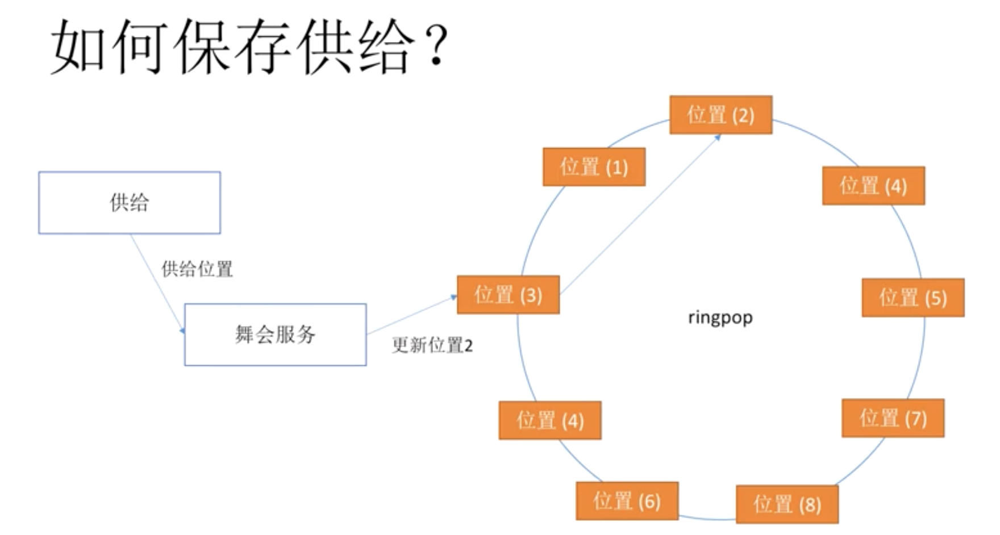

## Uber Architecture

#### Transformation
- Phase 1: phone -> PHP -> MySQL
    - Every 4 seconds, driver reports its location; users book according to driver location
- Phase 2: phone -> many independent PHP processes -> MySQL
    - Challenges: one car 2 customers, many concurrency issues
- Phase 3:
      
    
    - message queue to smooth the traffic
    - take certain business logic out of the initial dispatching service to reduce the load
    - redeliver on error with queue
- Phase 4:
    - dispatching service in Node.js and MySQL to MongoDB
    - move more service data in memory
    - 1 thread for Node.js -> no 1-driver-2-customers anymore
- Phase 5:
    - master slave DB in multi-DC to avoid single point-of-failure
    
    - Peak: 125/s
    - Average: 25/s
    - To prepare for the future: multiply by 10
    - Problems with the architecture
        1. the Python API part integrating with 3rd Party may fail
        1. failure leads to accumulation of messages, which keep retrying
        1. all components die eventually
    - Solution: circuit breaker; or limited retry
    
#### Current Status

##### Challenges
- Dynamic Supply: location of drivers constantly changing
- Dynamic Demand: location of consumers constantly changing

##### Components in Microservices

- Architecture Flaws:
    1. 1 driver - 1 passenger unable to support car pooling
    1. passenger - unable to support food delivery
    1. across city transportation since geo-data is divided based on city

    - 供给方和需求方 match!
    - currently write TPS 1M/s, 30K cars running simultaneously
    - Google S2 to mark all areas within 1 cm * 1 cm
    - how to match:
        1. less waiting
        1. less empty seat
        1. less travel
        1. travlling man problem, haha
    - uber ringpop to store car information
    - car location indication:
    
    - users to book:
    
    - double calculation to resolve bottleneck
    
    - encrypted location data in mobile
    

#### Conclusion
- Google S2 for map data
- ringpop for distributed storage and loadbalancing
- tchannel for remote invokation
