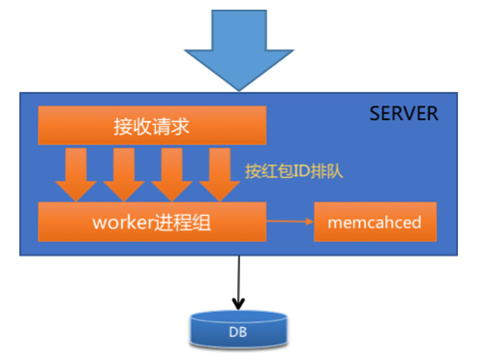

## WeChat Red Packet Function Design
referred from https://blog.csdn.net/u014477164/article/details/76687018
Let me know if it is not alright to use the photos
#### Requirements
1. Send a red packet to a person or a group of people
2. Super high concurrency, even higher than required by flash sale
3. Security: fund transfer has to be 100% accurate
4. No oversale or undersale
##### FlashSale Technical Challenges
- proxy -> server -> DB/Cache
- service layer to process business logic, DB to persist and cache to update inventory count
- The main focus is on inventory record update
  - DB operations: 1. lock inventory (to avoid oversale); 2: insert flash sale activity record; 3: update inventory
  - the 3 steps must be in 1 transaction
  - another challenge is lock from the first request will block the following requests
  - For WeChat red packet design, transactional requirements and DB load are more challenging
##### Normal FlashSale Solutions
1. Cache Operations over DB Transactions:
  - server -> cache synchronously -> DB persistence asynchronously
  - Data may get lost if cache to DB step fails

2. optimistic lock over pessimistic lock
  - if the snapshot has been altered by other transactions, revert. otherwise, commit
  - needs an algorithm to know if the a query result will change due to other writes
  - resolution to the lock
  - However, only one customer can successfully unwrap the red packet in this case
  - Not a good solution when contention is high
##### WeChat Solution
1. Vertical scaling (divide & conquer)
  - every red packet assigned an ID, basis for all following operations
  - 1 vertical chain contains 1 business server, 1 DB (a set)
  - all sets decoupled from each other -> lower DB load, lower server-side load

2. FIFO Queue to avoid concurrently competing for lock
  - stick same red packet related requests to the same server within one set, based on hashed(red packet ID)
  - queued in-memory, based on red packet ID
  - same machine, worker to process business logic

3. same-machine memcached to prevent too many requests with the same red packet ID
  - memcached to control concurrency, reject directly the request if number of requests exceeds the preset value
  - memcached CAS operations to reduce number of requests entering DB
4. Add date dimension during DB sharding (double dimension based on hash and date)
  - initial design based on red packet ID and its hashed value
  - after table size grows, separate hot data and cold data
  - sharding rule: db_xx.t_y_dd, xx/y is 3 digits after red packet ID, dd from 1-31
